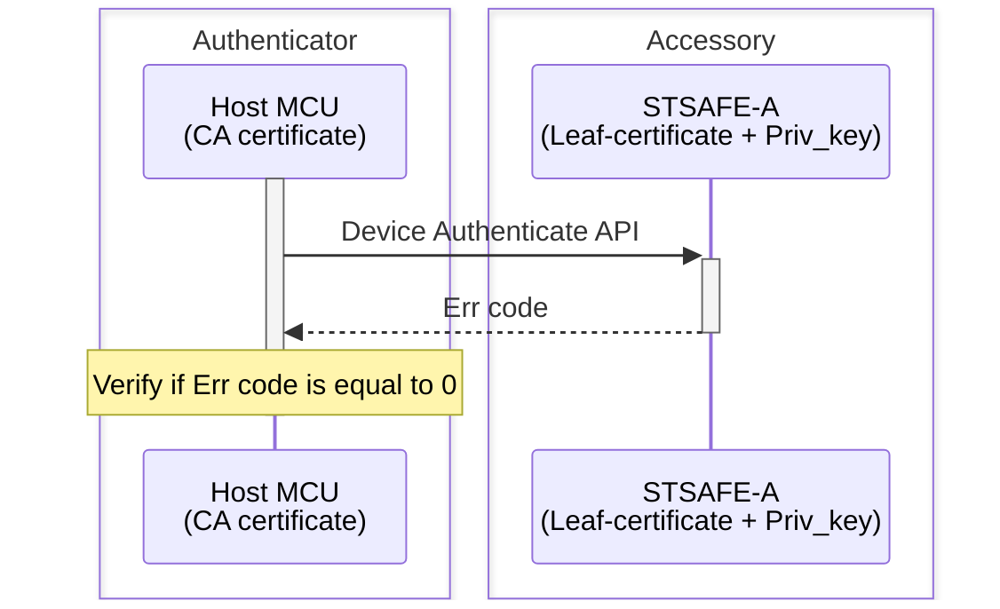
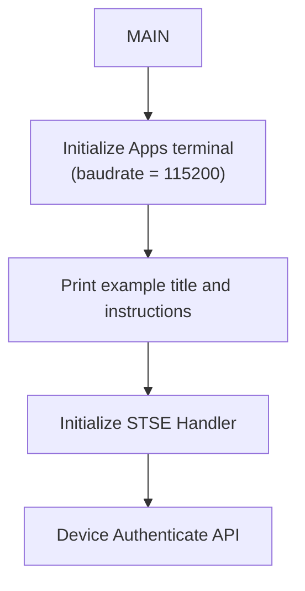

# STSAFE-A Accessory authentication

This project illustrates how to use the STSAFE-A Secure Element and STMicroelectronics Secure Element Library to perform device/accessory authentication. 
When loaded on the target MCU platform , the project performes an STSAFE-A authentication. 
This authentication scheme is typicaly used in accessories authentication use cases.

The example applicative flowchart is illustrated below :

STSELib API used in the example are the following :

- stse_init
- stse_certificate_parse
- stse_certificate_print_parsed_cert
- stse_certificate_get_key_type
- stse_certificate_verify_signature
- stse_certificate_is_parent
- stse_ecc_generate_signature

## Hardware and Software Prerequisites

- [NUCLEO-L452RE - STM32L452RE evaluation board](https://www.st.com/en/evaluation-tools/nucleo-l452re.html)

- [X-NUCLEO-ESE01A1 - STSAFE-A120 Secure element expansion board](https://www.st.com/en/ecosystems/x-nucleo-ese01a1.html)

- [STM32CubeIDE - Integrated Development Environment for STM32](https://www.st.com/en/development-tools/stm32cubeide.html)

- Serial terminal PC software  (i.e. Teraterm)

## Getting started with the project

- Connect the [X-NUCLEO-ESE01A1](https://www.st.com/en/ecosystems/x-nucleo-ese01a1.html) expansion board on the top of the [NUCLEO-L452RE](https://www.st.com/en/evaluation-tools/nucleo-l452re.html) evaluation board.

- Connect the board to the development computer and Open and configure a terminal software as follow (i.e. Teraterm).

- Open the STM32CubeIDE projects located in Application/STM32CubeIDE

- Build the project by clicking the “**Build the active configurations of selected projects\ **” button and verify that no error is reported by the GCC compiler/Linker.

- Launch a debug session then wait the debugger to stop on the first main routine instruction and press Start button to execute the main routine.

> [!NOTE]
> - Power configuation Jumper must be set to 3V3-VCC.
> - The COM port can differ from board to board. Please refer to windows device manager.

<b>Result</b> :

This project reports execution log through the on-board STLINK CDC bridge.
These logs can be analyzed on development computer using a serial terminal application (i.e.: Teraterm).
As example below.

<pre>
----------------------------------------------------------------------------------------------------------------
-                          STSAFE-A120 Device Authentication Example                               -
----------------------------------------------------------------------------------------------------------------
- This example illustrates STSAFE-A120 device authentication process using Multi-Step approach.                -
- it can be taken as reference for building distant server authentication use cases.                           -
----------------------------------------------------------------------------------------------------------------
 - Initialize target STSAFE-A120

 ## Device authentication over ST SPL05 CA certificate : Successful
</pre>
