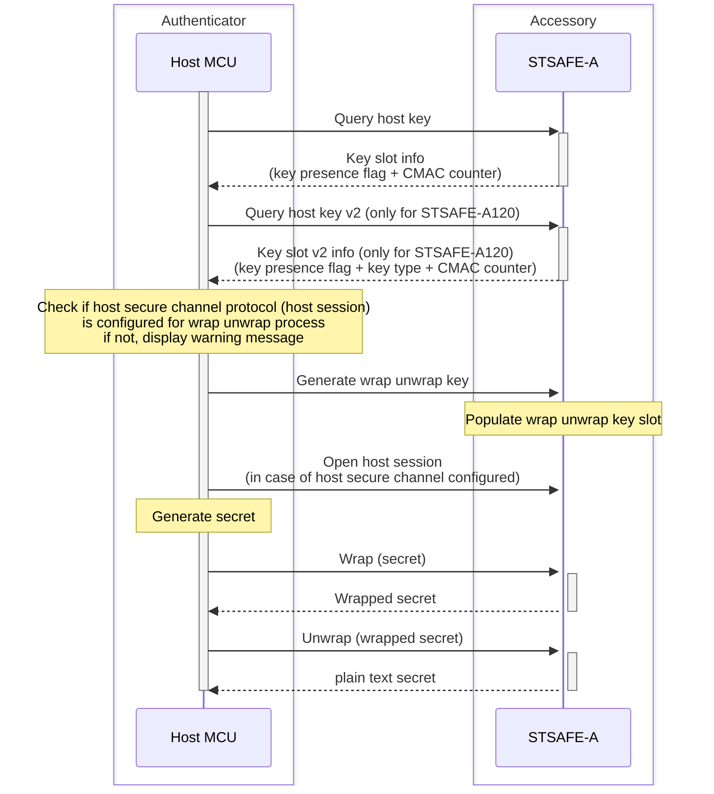
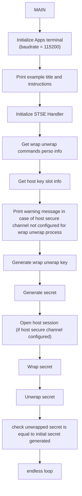

# STSAFE-A secret or key wrapping

This project illustrates how to use the STSAFE-A Secure Element and STMicroelectronics Secure Element Library to perform secret or key wrapping. 
When loaded on the target MCU platform , the project performs an secret or key wrapping & unwrapping. 
This wrapping scheme is typically used to store an encrypted secret (like a key) into MCU using encryption mechanism without knowing encryption key (key is stored through secure element and cannot be accessed).

The example applicative flowchart is illustrated below :

STSELib API & services used in the example are the following :

- stse_set_default_handler_value
- stse_init
- stsafea_perso_info_get_cmd_AC
- stsafea_perso_info_get_cmd_encrypt_flag
- stsafea_perso_info_get_rsp_encrypt_flag
- stsafea_query_host_key
- stsafea_query_host_key_v2
- stsafea_generate_wrap_unwrap_key
- stsafea_open_host_session (optionnaly)
- stsafea_wrap_payload
- stsafea_unwrap_payload

## Hardware and Software Prerequisites

- [NUCLEO-L452RE - STM32L452RE evaluation board](https://www.st.com/en/evaluation-tools/nucleo-l452re.html)

- [X-NUCLEO-ESE01A1 - STSAFE-A120 Secure element expansion board](https://www.st.com/en/ecosystems/x-nucleo-ese01a1.html)

- [STM32CubeIDE - Integrated Development Environment for STM32](https://www.st.com/en/development-tools/stm32cubeide.html)

- Serial terminal PC software  (i.e. Teraterm)

## Getting started with the project

- Connect the [X-NUCLEO-ESE01A1](https://www.st.com/en/ecosystems/x-nucleo-ese01a1.html) expansion board on the top of the [NUCLEO-L452RE](https://www.st.com/en/evaluation-tools/nucleo-l452re.html) evaluation board.

- Connect the board to the development computer and Open and configure a terminal software as follow (i.e. Teraterm).

- Open the STM32CubeIDE projects located in Application/STM32CubeIDE

- Build the project by clicking the “**Build the active configurations of selected projects\ **” button and verify that no error is reported by the GCC compiler/Linker.

- Launch a debug session then wait the debugger to stop on the first main routine instruction and press Start button to execute the main routine.

> [!NOTE]
> - Power configuation Jumper must be set to 3V3-VCC.
> - The COM port can differ from board to board. Please refer to windows device manager.

<b>Result</b> :

This project reports execution log through the on-board STLINK CDC bridge.
These logs can be analyzed on development computer using a serial terminal application (i.e.: Teraterm).
As example below.

<pre>
----------------------------------------------------------------------------------------------------------------
-                                    STSAFE-A110 key wrapping Example                                          -
----------------------------------------------------------------------------------------------------------------
- This example illustrates STSAFE-A110 device authentication process using Multi-Step approach.                -
- it can be taken as reference for building distant server authentication use cases.                           -
----------------------------------------------------------------------------------------------------------------
 - Initialize target STSAFE-A110

----------------------------------------------------------------------------------------------------------------
-                                          !!!!! WARNING !!!!!                                                 -
----------------------------------------------------------------------------------------------------------------
-           To avoid any leakage of secret through communication bus during wrap or unwrap process,            -
-                  it's recommended to activate host secure channel protocol (host_session)                    -
----------------------------------------------------------------------------------------------------------------

 - Plain-text buffer to be wrapped  :

  0x00 0x01 0x02 0x03 0x04 0x05 0x06 0x07 0x08 0x09 0x0A 0x0B 0x0C 0x0D 0x0E 0x0F

 - Wrapped buffer  :

  0x2E 0x2F 0xAF 0xDC 0x6C 0x61 0x19 0x98 0xD4 0x2D 0xDA 0x15 0xDD 0x2E 0x02 0xF2
  0x9A 0xD9 0xD4 0xEB 0xDF 0x4B 0xD9 0x30

 - Un-wrapped buffer  :

  0x00 0x01 0x02 0x03 0x04 0x05 0x06 0x07 0x08 0x09 0x0A 0x0B 0x0C 0x0D 0x0E 0x0F
</pre>
