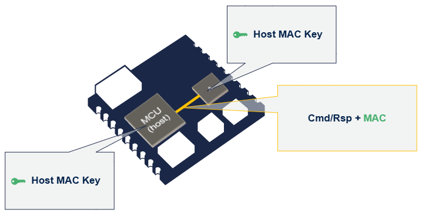

# Host key provisioning, Commands Access Conditions and encryption flag {#Host_key_provisioning_command_access_conditions_and_encryption_flags}

## STSAFE-A120 Host keys 

A unique couple of Host MAC key and Host cypher key can be established between the STSAFE-A120 device and its host processor.

This couple of keys can be used to restrict the access and execution of certain STSAFE-A commands to its Host only.  

The Host MAC key allows to compute Message Authentication Codes (MAC) ensuring both sender’s authenticity and message integrity (command or response).  
The MAC protects against malicious data injection on the communication line and is used as a condition to access Host key protected commands.  

The following interactions diagram shows a user NVM zone access with Host AC:

@startuml

    !define KEY <size:20><&key></size>
    !define MKEY <Color:$ST_BLUE>KEY</color>
    !define CKEY <Color:$ST_GREEN>KEY</color>

    'Define participant (define order = display order left to right)
    box Host
    participant "<b>Processor</b> \n (CKEY MKEY Host keys)" as HOST
    end box
    box Accessory
    participant "<b>STSAFE-A</b> \n (CKEY MKEY Host keys)" as STSE
    end box
    activate HOST $ST_DARK_BLUE_25     

    rnote over HOST
    Compute command 
    Message Authentication Code (MAC)
    using MKEY 
    end rnote
    HOST -> STSE : <b>Read/Update/Decrement</b> (Zone ID,offset,size,data) + <b>MAC</b>
    deactivate HOST $ST_DARK_BLUE_25
    Activate STSE $ST_DARK_BLUE_25
    rnote over STSE
    Verify command
    Message Authentication Code (MAC)
    using MKEY 
    end rnote
    return <b>Response</b> + <b>MAC</b>
    rnote over HOST
    Verify response
    Message Authentication Code (MAC)
    using MKEY 
    end rnote
    activate HOST $ST_DARK_BLUE_25
@enduml

The Host Cipher key enforces the confidentiality of command/response messages exchanged between the STSAFE-A and its Host.  
The Host cypher key is used in complement of the Host MAC key that enforce authenticity and integrity of a message. 

Following diagram shows the processes and interactions required for executing a user NVM zone update command using Host AC with ciphering. 
 
@startuml
    !define KEY <size:20><&key></size>
    !define MKEY <Color:$ST_GREEN>KEY</color>
    !define CKEY <Color:$ST_BLUE>KEY</color>
    !define MAC <Color:$ST_GREEN><b>MAC</b></Color>
    'Define participant (define order = display order left to right)
    participant "<b>Processor</b> \n (CKEY MKEY Host keys)" as HOST
    participant "<b>STSAFE-A</b> \n (CKEY MKEY Host keys)" as STSE
    activate HOST $ST_DARK_BLUE_25     
    rnote over HOST
    Encrypt <Color:$ST_BLUE><b>Update</b></color> command
    using CKEY 
    end rnote
    rnote over HOST
    Compute command MAC
    using MKEY 
    end rnote
    HOST -> STSE : <Color:$ST_BLUE>[<b>Update</b> (Zone ID,offset,size,data)]</Color> + MAC
    deactivate HOST $ST_DARK_BLUE_25
    Activate STSE $ST_DARK_BLUE_25
    rnote over STSE
    Verify command MAC
    using MKEY 
    end rnote
    rnote over STSE
    Decrypt <Color:$ST_BLUE><b>Update</b></color> command
    using CKEY 
    end rnote
    rnote over STSE
    Update zone
    end rnote
    rnote over STSE
    Encrypt <Color:$ST_BLUE><b>Response</b></color>
    using CKEY 
    end rnote
    rnote over STSE
    Compute Response MAC
    using MKEY 
    end rnote
    return <Color:$ST_BLUE>[ <b>Response</b> ]</color> + MAC
    rnote over HOST
    Verify Response MAC
    using MKEY 
    end rnote
    activate HOST $ST_DARK_BLUE_25
    rnote over HOST
    Decrypt <Color:$ST_BLUE><b>Response</b></color> 
    using CKEY 
    end rnote
    activate HOST $ST_DARK_BLUE_25
@enduml

## STSAFE-A120 Commands access conditions. 

The access conditions and encryption of the following STSAFE-A120 command set can be configured at STMicroelectronics Factory or on the field as one-time programable setting.  
Recommended settings is the following:

| Command | Host Authentication | Cmd encryption | Rsp encryption
|:---:|:---:|:---:|:---:|
| Echo | - | - | - |  
| Generate MAC | - | - | - |  
| Verify MAC | - | - | - | 
| Wrap local envelope | x | x | - |
| Unwrap local envelope | x | - | x |  
| Generate signature | - | - | - |   
| Establish key | x | - | x |   
| Encrypt | x | x | - |  
| Decrypt | x | - | x |   
| Generate random | - | - | - |  
| Decrement (AC configuration per zone) | - | - | - |  
| Read (AC configuration per zone) | - | - | - |  
| Update (AC configuration per zone) | - | - | - |  
| Generate key | - | - | - |   
| Get signature | - | - | - |    
| Verify signature | - | - | - |   
| Start hash | - | - | - |   
| Process hash | - | - | - |   
| Finish hash | - | - | - |   
| Start volatile KEK session | - | - | - |   
| Establish symmetric key | - | - | - |  
| Confirm symmetric keys | - | - | - |   
| Stop volatile KEK session | - | - | - |   
| Write host key plaintext | - | - | - |   
| Write host key wrapped | - | - | - |   
| Write symmetric key | - | - | - |   
| Write public key | - | - | - |   
| Generate ECDHE key | - | - | - |   
| Generate challenge| - | - | - |   
| Verify entity signature | - | - | - |  
| Derive keys | - | - | - |   
| Start encrypt | x | x | - |   
| Process encrypt | x | x | - |   
| Finish encrypt | x | x | - |   
| Start decrypt  | x | - | x |  
| Process decrypt | x | - | x |   
| Finish decrypt | x | - | x |   
| Write symmetric key plaintext | - | - | - |    
| Establish host key V2 | - | - | - |   
| Erase symmetric key slot | - | - | - |  

> **IMPORTANT:**  
> The SPL05 generic profile allows developpers to set the command Access Condition once.  
> It is recommended to set the Command AC according to end-device application needs.  
> For STSAFE-A120 device evaluation purpose , it is recommended to use the "SPL05".

## Host keys provisioning options 

STSAFE-A120 devices are provided with empty Host keys slot.  
It is up to OEM to use one of the following pairing methods to provision/establish the host keys slot. 
- Write host Keys (plain text). 
- Write host Keys wrapped. 
- Write host Keys wrapped authenticated. 

### Write host Key (plain text). 

The Host keys can be sent in plain text by the Host to the STSAFE through the command “Write host key”.  
The following diagram illustrates the write host key (plain text) process: 

@startuml
    !define KEY <size:20><&key></size>
    !define MKEY <Color:$ST_GREEN>KEY Host MAC key </color>
    !define CKEY <Color:$ST_BLUE>KEY Host Cipher key </color>

    'Define participant (define order = display order left to right)
    participant "<b>HOST</b> \n MKEY \n CKEY" as HOST
    participant "<b>STSAFE-A</b> " as STSE
    activate HOST $ST_DARK_BLUE_25     

    HOST -> STSE : <b>Write Host keys</b> (MKEY,CKEY)
    deactivate HOST $ST_DARK_BLUE_25
    Activate STSE $ST_DARK_BLUE_25

    rnote over STSE
    Store 
    MKEY and CKEY 
    in host key slot  
    end rnote

    return status
@enduml

> **IMPORTANT:**  
> This provisioning method is recommended only under a secure production environment or with test keys during STSAFE-A120 evaluation phase.  
> In a production context , it is recommended to randomize the host key on each Host STSAFE-A120 companion pair.  
> As illustrated in the interaction diagram below:

@startuml
    !define KEY <size:20><&key></size>
    !define MKEY <Color:$ST_GREEN>KEY Host MAC key </color>
    !define CKEY <Color:$ST_BLUE>KEY Host Cipher key </color>

    'Define participant (define order = display order left to right)
    participant "<b>HOST</b> " as HOST
    participant "<b>STSAFE-A</b> " as STSE
    activate HOST $ST_DARK_BLUE_25     

    rnote over HOST
    Generate random
    MKEY and CKEY
    (TRNG)
    end note

    rnote over HOST
    Store 
    MKEY and CKEY   
    end rnote

    HOST -> STSE : <b>Write Host keys</b> (MKEY,CKEY)
    deactivate HOST $ST_DARK_BLUE_25
    Activate STSE $ST_DARK_BLUE_25

    rnote over STSE
    Store 
    MKEY and CKEY 
    in host key slot  
    end rnote

    return status
@enduml

### Write host Key wrapped. 

Host keys can be sent by the Host to an STSAFE-A120  wrapped in a secure envelope.  
This envelope, composed of encrypted keys and a MAC, protects the Host keys during their transfer to the STSAFE-A device.

@startuml
    !define KEY <size:20><&key></size>
    !define ENV <size:20><&envelope-closed></size>
    !define MKEY <Color:$ST_GREEN>KEY Host MAC key </color>
    !define CKEY <Color:$ST_BLUE>KEY Host Cipher key </color>
    !define KEKEY <Color:$ST_YELLOW>KEY KEK </color>
    !define SECENV <Color:$ST_YELLOW> ENV [secure envelope]</Color>

    'Define participant (define order = display order left to right)
    participant "<b>HOST</b> \n MKEY \n CKEY" as HOST
    participant "<b>STSAFE-A</b> " as STSE
    activate HOST $ST_DARK_BLUE_25     

    rnote over HOST,STSE
    Open KEK session 
    (KEKEY) 
    end note

    rnote over HOST
        wrap 
        CKEY and MKEY
        in SECENV
    end note

    HOST -> STSE : <b>Write Host keys wrapped </b> (SECENV)
    deactivate HOST $ST_DARK_BLUE_25
    Activate STSE $ST_DARK_BLUE_25

    rnote over STSE
        unwrap 
        SECENV
    end note

    rnote over STSE
    Store 
    MKEY and CKEY 
    in host key slot  
    end rnote

    return status
    
    rnote over HOST,STSE
    Close KEK session  
    end note
@enduml

The key used to wrap and unwrap the envelope is called a Key Encryption Key (KEK).  
The KEK must be established between the Host and the STSAFE-A device prior to sending the “write host key wrapped” command to the STSAFE-A120 device.  
KEK establishment process is ilustrated below . 

### Write host Key Wrapped Authenticated

This establishment can optionally be authenticated by verifying the Host authenticity during key exchange (asymmetric process). 

@startuml

    !define KEY <size:20><&key></size>
    !define ENV <size:20><&envelope-closed></size>
    !define MKEY <Color:$ST_GREEN>KEY Host MAC key </color>
    !define CKEY <Color:$ST_BLUE>KEY Host Cipher key </color>
    !define KEKEY <Color:$ST_YELLOW>KEY KEK </color>
    !define PRIVKEY <Color:$ST_PURPLE>KEY Private key </color>
    !define PUBKEY <Color:$ST_PURPLE>KEY Public key </color>
    !define SECENV <Color:$ST_YELLOW> ENV [secure envelope]</Color>

    'Define participant (define order = display order left to right)
    participant "<b>HOST</b> \n PRIVKEY \n MKEY \n CKEY" as HOST
    participant "<b>STSAFE-A</b> \n PUBKEY" as STSE
    activate HOST $ST_DARK_BLUE_25     

    rnote over HOST,STSE
    Open Authenticated KEK Session 
    (KEKEY PRIVKEY/PUBKEY) 
    end note

    rnote over HOST
        wrap 
        CKEY and MKEY
        in SECENV
    end note

    HOST -> STSE : <b>Write Host keys wrapped authenticated</b> (SECENV)
    deactivate HOST $ST_DARK_BLUE_25
    Activate STSE $ST_DARK_BLUE_25

    rnote over STSE
        unwrap 
        SECENV
    end note

    rnote over STSE
    Store 
    MKEY and CKEY 
    in host key slot  
    end rnote

    return status
    
    rnote over HOST,STSE
    Close Authenticated KEK session  
    end note
@enduml

---

© 2025 STMicroelectronics – All rights reserved

 

 