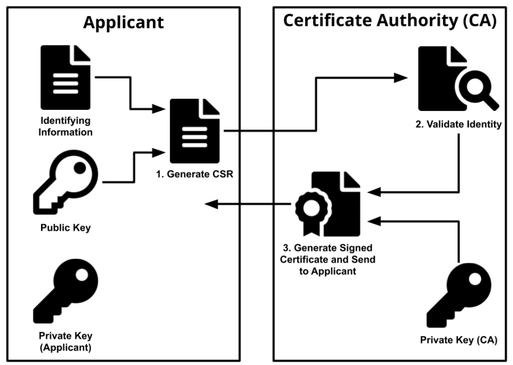
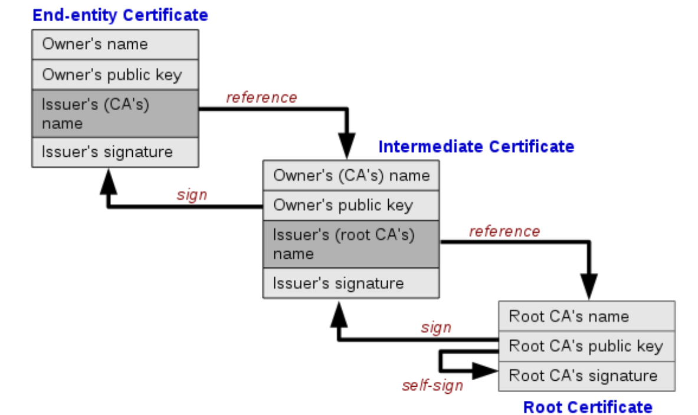
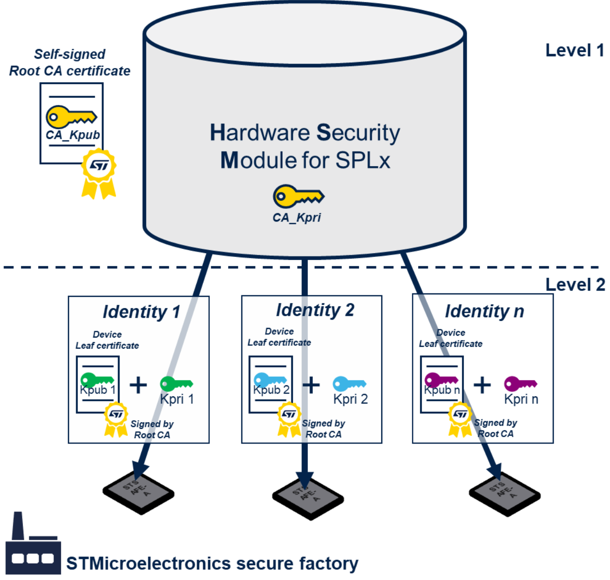
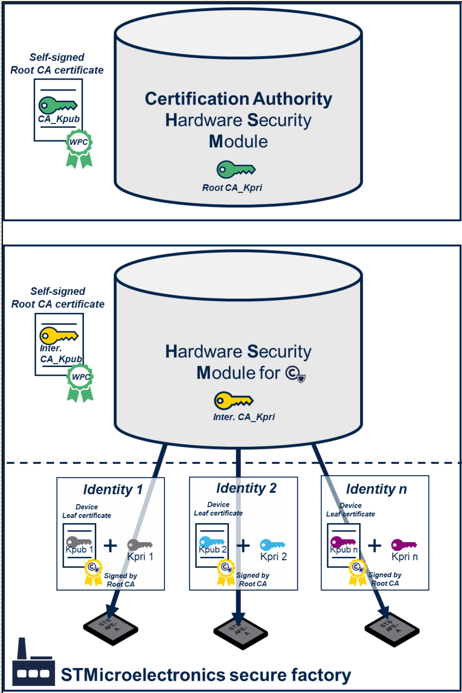
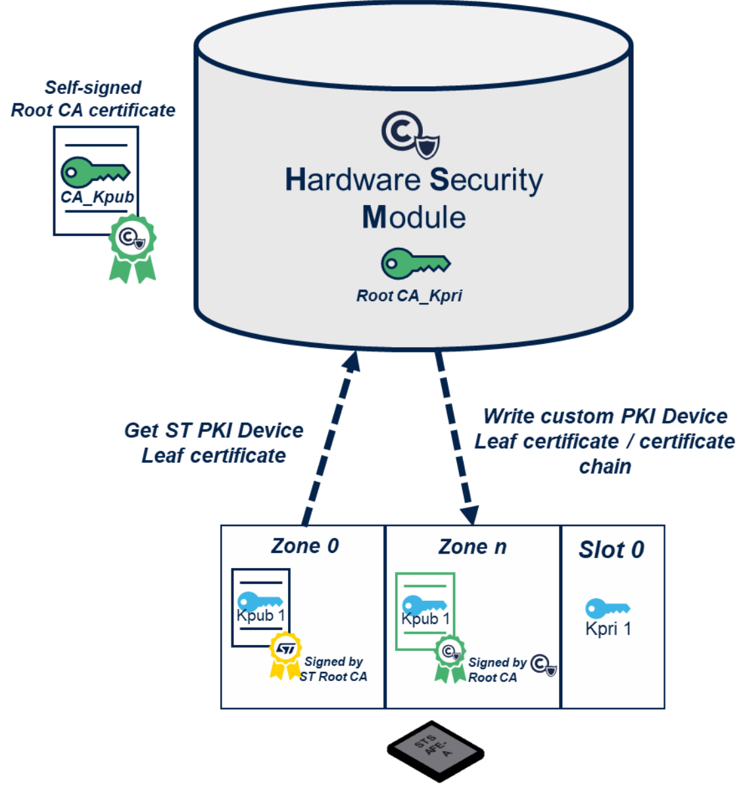
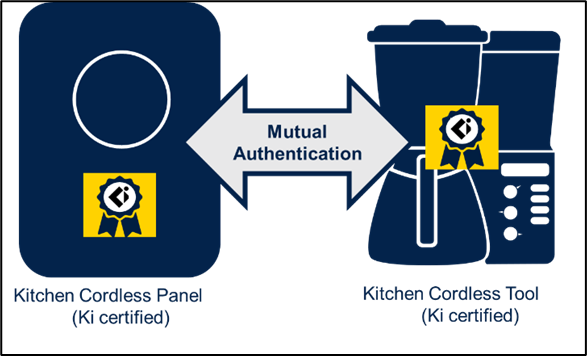

# Private key table and leaf certificate(s) {#Private_key_table_and_leaf_certificates}

The **Private Key Table** in the STSAFE-A120 device is a critical component for managing private keys used in cryptographic operations such as signature generation and key establishment. It consists of a fixed number of slots, each capable of securely storing a private key along with its associated attributes and usage policies.

## Private key Slots

- The private key table contains **6 slots** in total:
  - **5 static slots** stored in device non-volatile memory (User-NVM).
  - **1 ephemeral slot** stored in device volatile memory (RAM).

### **Slot 0** is pre-provisioned by STMicroelectronics during device personalization.

Slot 0 is provisioned during device personalization and contains a private key used as the device's root or leaf private key. This key is associated with a leaf certificate pre-provisioned in user NVM slot 0, enabling secure authentication tied to a trusted certificate chain. This setup enables the device to perform secure authentication and cryptographic operations tied to a trusted certificate chain.

### Usage of Additional Private Key Slots (Slots 1 to 4)

Slots 1 to 4 are available for application-specific private keys. They can be provisioned during personalization by ST or dynamically on demand by a host processor .
When provisioned by STMicroelectronics during personalization, these slots come preloaded with private keys tailored to the customer's security requirements, ensuring secure and controlled deployment. 

Alternatively, the host can generate keys in these slots (post-personalization) using the device’s **Generate Key** command. this command subject to slot access conditions and authorization flags . these flags can be configured as OTP by the host or pre-configured during device pre-provisioning for each slot. This dynamic provisioning capability allows for secure key lifecycle management, including key rotation or renewal, without requiring physical device replacement.

slots 1 to 4 offer a secure and flexible key management framework that can be adapted to evolving application needs, either through initial provisioning by STMicroelectronics or secure on-demand provisioning by the host, enabling robust and scalable security architectures.

## Applicative Usage of Private Key Slots

| Slot Number | Type       | Usage Description                                                                                   | Key Storage Location | Usage Limits & Controls                          |
|-------------|------------|---------------------------------------------------------------------------------------------------|----------------------|-------------------------------------------------|
| 0           | Static     | Pre-provisioned private key for device identity; used for signature generation and authentication | User-NVM               | Usage limited by personalization; associated with leaf certificate in user NVM slot 0 |
| 1 to 4      | Static     | Available for application-specific private keys for signatures, key establishment, or other uses  | User-NVM               | Usage limits by personalization or configurable; can be generated by host under access control |
| 5 (0xFF)    | Ephemeral  | Temporary private key used exclusively for key establishment (ECDH); erased after use or reset    | RAM                  | Single-use key; cannot be used for signature generation |

## Key Attributes and Controls

- **Mode of Operation Flags**: Each slot has authorization flags controlling:
  - Whether signature generation over internal/external data is allowed.
  - Whether signature generation over externally provided data is allowed.
  - Whether key establishment operations are authorized.

- **Usage Limits**:
  - Static slots have configurable usage limits (number of allowed operations).
  - Ephemeral slot usage is limited to a single operation.

- **Change Rights**:
  - Authorization flags can be updated once during the device lifetime for static slots.
  - Ephemeral slot flags are mostly fixed except for generate key access condition.

> **IMPORTANT:** For security reason it is recommende dedicate one slot per 

## Integration with Leaf Certificate

The private key in Slot 0 is tightly coupled with a **leaf certificate stored in user NVM slot 0**.
This certificate contains the corresponding public key and is used by the host or external entities to verify signatures generated by the private key.
This arrangement supports secure device identity verification and trusted communication in applications such as secure boot, TLS client authentication, or device attestation.

## X.509 Leaf Certificate Structure

Each STSAFE-A device is provisioned with at least one unique X.509 certificate, which binds the device’s public key to its identity. 
The certificate contains several fields, including:

| X.509 Field | Description |
| :---: | :--- |
| Version | Certificate version (X.509 v3) |
| Serial Number | Unique integer assigned by the CA |
| Algorithm ID | Algorithm used to sign the certificate |
| Issuer | Entity that issued the certificate |
| Validity | Time interval certificate is valid |
| Subject | Entity associated with the public key |
| Subject Public Key Info | Public key and algorithm details |
| Issuer Unique Identifier | Optional issuer info |
| Subject Unique Identifier | Optional subject info |
| Extensions | Optional extra info |
| Signature | Digital signature from CA’s private key |

The certificate’s digital signature is generated from a hash of the certificate data, ensuring integrity and authenticity. Any modification to the certificate data will result in signature verification failure, preventing tampering and unauthorized changes.

## STSAFE-A120 Certificate Authority and Public Key Infrastructure (PKI)

A Certificate Authority (CA) is a trusted organization responsible for issuing and managing certificates. In embedded systems, CAs may include secure element manufacturers (such as STMicroelectronics), OEMs, or third-party providers.

To support large-scale deployments, a hierarchical PKI is used. A root CA issues intermediate CA certificates, which in turn sign device certificates. This creates a certificate chain, establishing a chain of trust from the root CA to each device.

PKI encompasses CAs, key pairs, and certificates, forming the backbone of secure device identity and authentication.

### STMicroelectronics PKI for SPL05 Personalization Profile

All STSAFE-A devices are pre-provisioned in STMicroelectronics’ secure factory with a unique key pair and certificate, forming part of the STMicroelectronics PKI.

The PKI hierarchy begins with a self-signed root certificate. Each STSAFE-A120 SPL05 device receives a unique private key and a leaf certificate signed by the root CA.

> **_IMPORTANT:_** All STSAFE-A120 SPLx devices share the same PKI and CA. Devices are differentiated by their serial numbers. OEMs using SPLx samples for production should regenerate their own leaf certificates or carefully track serial numbers to maintain security.

### STMicroelectronics PKI for Custom Personalization Profiles

For OEMs requiring tailored security, ST offers a custom two-level PKI service for orders of 5,000 devices or more.

Custom PKI features include:
- Dedicated root CA for each OEM profile
- Customizable certificate content (excluding serial number and public key)
- Personalized device profiles with custom keys and configurations

### Third-party PKI with STMicroelectronics as Intermediate CA

Intermediate CAs provide additional flexibility and security, allowing different organizations to manage their own certificate hierarchies. For example, STMicroelectronics can act as an intermediate CA for the Wireless Power Consortium.

Compared to the standard ST PKI, third-party PKI with ST as intermediate CA offers:
- Dedicated intermediate CA per profile
- Customizable certificate content
- Personalized device profiles with pre-provisioned keys

### OEM and Third-party PKI Integration

SPL05 devices can be reassigned to OEM or third-party PKI through a certificate rotation process, enabling flexible integration with existing security infrastructures.

This flexibility allows OEMs to leverage in-house or third-party services for:
- Security lifecycle management
- Identity and Access Management (IAM)
- Cloud security integration
- Code signing for secure software deployment

For more information, see ST Partners Program:
- [Keyscaler](https://www.st.com/en/partner-products-and-services/keyscaler.html)
- [KeyFactor](https://www.st.com/content/st_com/en/partner/partner-program/partnerpage/Keyfactor.html)
- [Commscope](https://www.pki-center.com/)

### Third-party Certification Programs (WPC Qi / Ki Example)

STSAFE-A supports third-party certification programs, such as Qi wireless charging and Ki cordless kitchen certification from the Wireless Power Consortium (WPC). Qi certification ensures wireless charging products meet stringent safety and performance standards, while Ki certification applies similar standards for kitchen appliances.

>**NOTE:** To achieve Qi or Ki certification, products must undergo authorized laboratory testing to verify compliance with WPC requirements.

---

© 2025 STMicroelectronics – All rights reserved