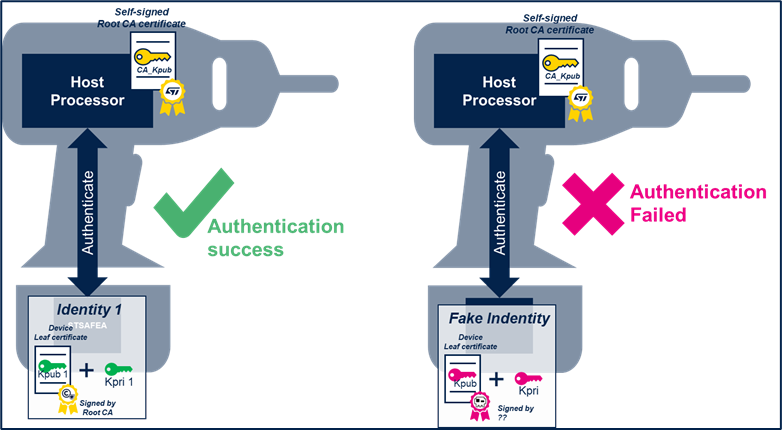
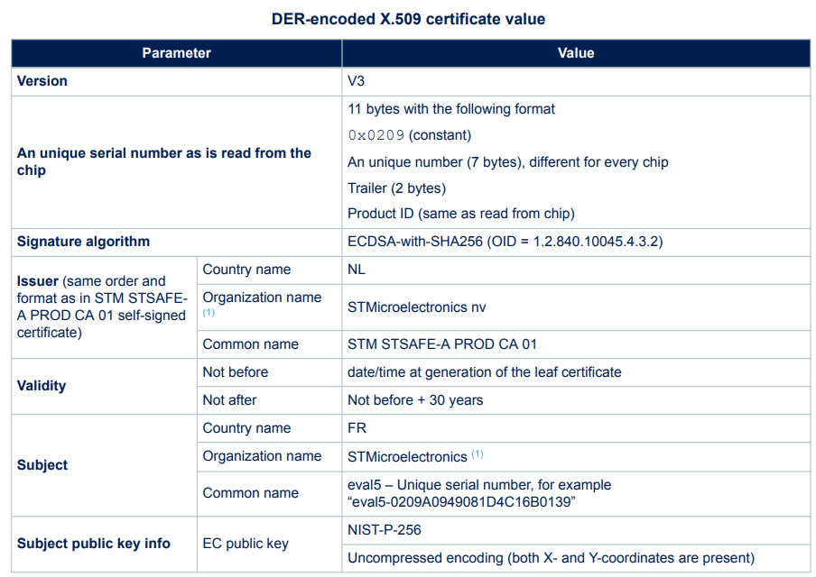

# STSAFE-A120 for End-Device Identity and Authentication {#End_device_identity_and_authentication}

The STSAFE-A120 is a dedicated secure element engineered to deliver robust, hardware-based identity and authentication for end devices.

By integrating the STSAFE-A120 into your design, each device is provisioned with a unique, tamper-resistant identity, ensuring that cryptographic keys and credentials are stored in a secure, isolated environment.

This permanent identity is protected against cloning and unauthorized extraction, forming the foundation for trusted device authentication in connected systems.

## Overview of Device Identity and Authentication

In today’s interconnected networks, reliably identifying and authenticating devices is essential for maintaining security and trust.  
The STSAFE-A120 addresses this requirement by securely storing cryptographic keys and credentials, enabling devices to prove their identity using strong cryptographic protocols.  
All sensitive operations are performed internally within the secure element, ensuring that private keys and credentials are never exposed to the main processor or external interfaces.

Devices equipped with the STSAFE-A120 can participate in challenge-response authentication protocols, interact securely with servers or cloud platforms, and prevent unauthorized access.  
Only devices with valid credentials can successfully authenticate, significantly enhancing the overall security posture of the system.

The integration of STSAFE-A120 devices provides several key security benefits:

- **Hardware-based security:** All sensitive data, including cryptographic keys, are stored and managed within the STSAFE-A120 secure element, isolated from the main processor and system memory.  
  This isolation greatly reduces the attack surface and protects against software-based threats.
- **Attack resistance:** The device is engineered to resist a wide range of attacks, including physical tampering, side-channel analysis, and software exploits.  
  This ensures long-term protection of credentials and device integrity.
- **Secure key management:** Key pairs are generated, stored, and used exclusively inside the secure element.  
  Private keys never leave the device, minimizing the risk of compromise and unauthorized access.

Typical authentication use cases include:

- **Consumer electronics:** Protects against counterfeit devices and unauthorized access to services or data, ensuring only genuine products can interact with the ecosystem.
- **Industrial systems:** Verifies device authenticity for critical infrastructure, supporting secure operations, maintenance, and lifecycle management.
- **IoT devices:** Ensures only authenticated devices can connect to networks, preventing rogue device access and supporting secure onboarding.
- **Cloud services:** Enables secure device-to-cloud authentication, supporting scalable, reliable, and secure deployments in distributed environments.

## STSAFE-A120 Device Authentication Process

The STSAFE-A120 leverages Elliptic Curve Cryptography (ECC) for device authentication.  
Each device is provisioned with a unique ECC key pair: the private key remains securely stored inside the STSAFE-A120, while the public key can be distributed as needed.  
All ECC operations, including digital signature generation and verification, are performed within the secure element, ensuring that private keys are never exposed.

The following diagram illustrates the device authentication workflow using the Elliptic Curve Digital Signature Algorithm (ECDSA):

@startuml

    skinparam ParticipantPadding 20
    skinparam BoxPadding 50

    !define DOC <size:20><&document></size>
    !define SIG <size:20><&pencil></size>
    !define KEY <size:20><&key></size>
    !define HSH <size:20><b>#</b></size> 

    !define MESSAGE <i>Message</i>
    !define SIGNATURE <i>Digital_Signature</i>
    !define CHAL <i>Challenge</i>
    !define CERT <i>Certificate</i>
    !define KPUB <Color:$ST_GREEN>KEY</color><b><i>Dev_Kpub</i></b> 
    !define KPRI <Color:$ST_PINK>KEY</color><b><i>Dev_Kpri</i></b>
    !define CA_KPUB <Color:$ST_YELLOW>KEY</color><b><i>CA_Kpub</i></b>

    'Define participant (define order = display order left to right)

    box Authenticator
    participant "Processor \n CA_KPUB" as RECEIVER
    end box

    box Device
    participant "Processor" as SENDER
    participant "<color:$ST_DARK_BLUE><b>STSAFE-A</b></color> \n <Color:$ST_PINK>KEY</color><Color:$ST_DARK_BLUE><b><i>Dev_Kpri</i></b>" as STSE $ST_YELLOW
    end box

    activate RECEIVER $ST_DARK_BLUE_25
        group Device certificate verification
            RECEIVER -> SENDER : Get CERT
            activate SENDER $ST_DARK_BLUE_25
            SENDER -> STSE : read zone 0
            activate STSE $ST_DARK_BLUE_25
            return CERT
            SENDER --> RECEIVER : CERT
            deactivate SENDER
            rnote over RECEIVER
            Verify certificate 
            using CA_KPUB
            end note
            alt $ST_GREEN_25 <b>Certificate verification : <color:$ST_GREEN>PASS</color></b> 
            rnote over RECEIVER
            certificate is valid 
            end note
            else $ST_PINK_25 <b>Certificate verification : <color:$ST_PINK>FAIL</b> 
            rnote over RECEIVER 
            certificate is not valid 
            end note
            end if
        end group

group Device authentication (if certificate is valid)
        RECEIVER -> SENDER : CHAL 
        activate SENDER $ST_DARK_BLUE_25
        SENDER -> STSE : <b>ECDSA_Sign</b> (CHAL)
        deactivate SENDER 
        activate STSE $ST_DARK_BLUE_25
        rnote over STSE
        Generate signature 
        using KPRI
        (ECDSA sign) 
        end note
        return SIGNATURE
        activate SENDER $ST_DARK_BLUE_25

        SENDER --> RECEIVER :SIGNATURE
        deactivate SENDER
        
        rnote over RECEIVER
        Verify signature 
        using KPUB
        (ECDSA verify)
        end note

        alt $ST_GREEN_25 <b>Signature verification : <color:$ST_GREEN>PASS</color></b> 
        rnote over RECEIVER
        ECDSA challenge Successfull
        end note
        else $ST_PINK_25 <b>Signature verification : <color:$ST_PINK>FAIL</b> 
        rnote over RECEIVER 
        ECDSA challenge Failed
        end note
        end if
    end group
@enduml

ECC provides strong security with efficient key sizes, making it ideal for embedded and resource-constrained environments.  
For example, a 256-bit ECC key offers greater security than a 2048-bit RSA key, with lower computational and memory requirements.

A critical aspect of public key authentication is verifying that a public key is associated with an authorized device.  
This is achieved through certificates issued by trusted Certificate Authorities (CAs).  
Devices presenting public keys without valid certificates are not trusted.  
The diagram above demonstrates how certificate verification is integrated into the authentication process.

## STSAFE-A120 Private key table and leaf-certificate 

All STSAFE-A120 devices **Slot 0** are pre-provisioned by STMicroelectronics during device personalization.  
This slot contains a private key that is typically used as the device's **root or leaf private key**.
The private key in Slot 0 is associated with a **leaf certificate** that is pre-provisioned in the **user non-volatile memory (NVM) slot 0**.  
This setup enables the device to perform secure authentication and cryptographic operations tied to a trusted certificate chain.

See below the leaf-certificate of SPL05 generated by "STM STSAFE-A PROD CA 01" certificate authority:

Additional cetificate can be added in specific custom perso profile or by host after generating a new key pair and building a certificate (ie. CSR to a certificate authority).  
Please refer to section [Private key table and leaf certificate(s)](#Private_key_table_and_leaf_certificates) for more details on STSAFE-A120 keypairs and certificate pre-provisioning/provisioning capabilities.

## Related examples

The following examples illustrates the End-device authentication process using STSAFE-A120 secure element:

- [STSAFE-A120 Device authentication example](#STSAFE-A120_Device_authentication)
- [STSAFE-A120 Device authentication Multi-steps example](#STSAFE-A120_Multi-step_device_authentication)

---

© 2025 STMicroelectronics – All rights reserved
