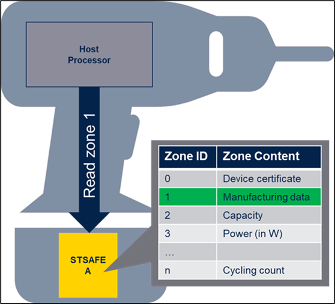
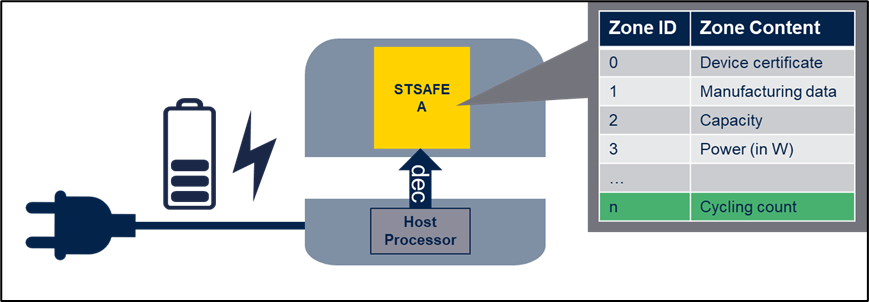
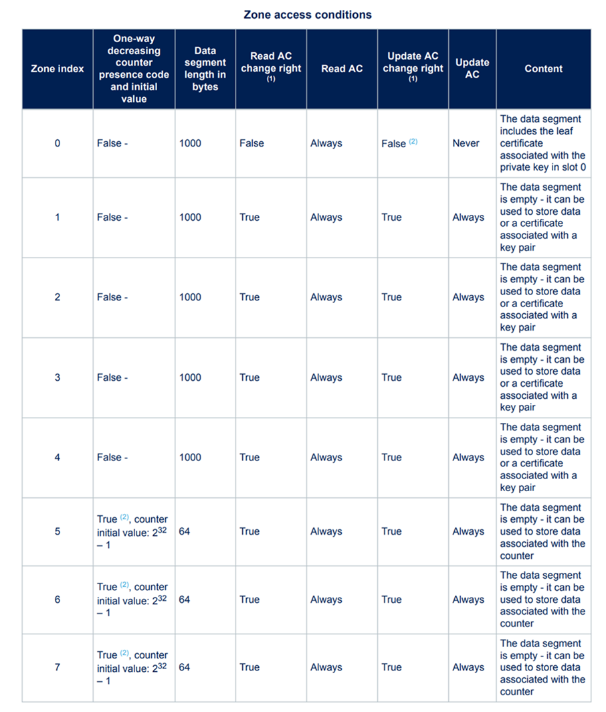
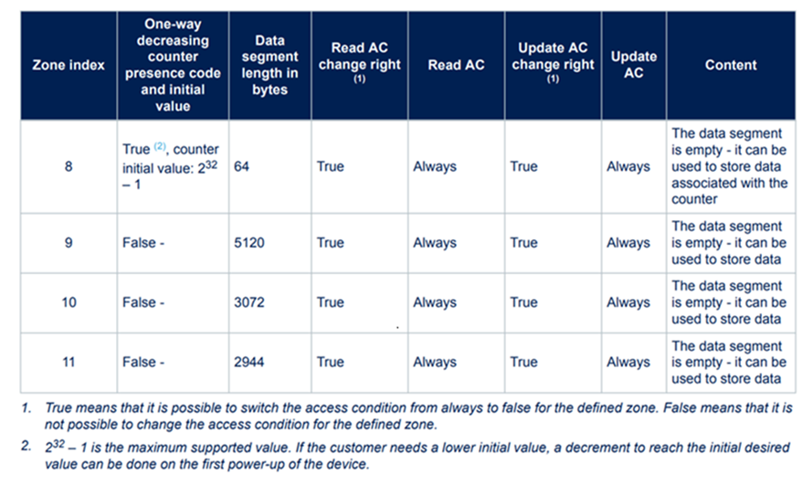

# STSAFE-A120 for End-Device Secure Storage and Usage Monitoring {#End_device_life_cycle_monitoring}

The STSAFE-A120 secure element is a highly integrated, hardware-based solution specifically designed to meet the security requirements of embedded systems. By leveraging its tamper-resistant architecture, the STSAFE-A120 provides a secure environment for the storage and management of sensitive assets, such as cryptographic secrets, device configuration parameters, and usage records. This isolation of critical data within the secure element ensures robust protection against unauthorized access, extraction, or manipulation, thereby enhancing the overall trustworthiness of the device.

The integration of STSAFE-A120 devices provides several key security benefits:

- **Tamper-Resistant Hardware:**  
    The STSAFE-A120 incorporates advanced countermeasures against both physical and logical attacks. Its secure architecture is engineered to withstand invasive and non-invasive threats, ensuring that sensitive information remains protected throughout the device’s lifecycle.

- **Monotonic Counters and Secure Memory:**  
    Integrated monotonic counters and secure memory blocks enable reliable tracking of device usage events. These counters are designed to prevent rollback or tampering attempts, supporting accurate monitoring of operational cycles, consumable usage, or maintenance events.

- **Secure Messaging Protocols:**  
    The device supports secure messaging protocols that authenticate and encrypt communications between the host microcontroller and the secure element. This ensures both data integrity and confidentiality, protecting against eavesdropping and command injection.

- **Flexible User-NVM Zones:**  
    Up to 16 kBytes of User-NVM memory can be partitioned into multiple logical zones. Each zone can be configured with customizable access conditions and optional counter functionality, allowing for granular control over data storage and access rights.

The STSAFE-A120’s flexible User-NVM zones provide original equipment manufacturers (OEMs) with the capability to securely store and monitor a wide variety of end-device information, including but not limited to:

- **One-Time Programmable Information:**  
    - Product configuration  
    - Calibration data  
    - Product version  
    - Regional information  

- **Device Lifecycle Information:**  
    - Production date and flow  
    - Quality logs  
    - Servicing records  

- **Usage Control:**  
    - Prevention of unwanted excessive use of the device  
    - Limitation of accessory usage via one-way counters  

Monitoring device usage is essential for several reasons, including brand protection, product traceability, mitigation of gray market activities, and enforcement of quality and safety standards. The STSAFE-A120 enables OEMs to implement these controls in a secure and auditable manner.

> **IMPORTANT:** Host key provisioning and secure session enablement are prerequisites for secure access to the STSAFE-A120 User-NVM. Refer to the relevant section for further details on establishing secure communication channels.

## STSAFE-A120 User-NVM Partitioning

The STSAFE-A120 device features up to 16 kBytes of physical User-NVM memory, which is intended for storing customer digital assets and monitoring end-application usage. This memory is partitioned into logical zones, as defined in the chip personalization profile during manufacturing at the STMicroelectronics factory.

Below is an extract from the [STSAFE-A120 SPL05 Generic sample profile description](https://www.st.com/resource/en/application_note/an6053-stsafea120-spl05-generic-sample-profile-description-stmicroelectronics.pdf), illustrating device User-NVM partitioning:

> **Note:** STSAFE-A120 User-NVM can be pre-provisioned with custom partitioning data that are part of a static personalization profile defining the number of zones, their sizes, and the presence of one-way counters. This profile is defined per customer and loaded at the STMicroelectronics Secure Factory . this profile cannot be changed post-manufacturing.

### Types of User-NVM Zones

The STSAFE-A120 supports two primary types of User-NVM zones:

- **Zone without Counter:**  
    These are standard data storage zones, suitable for storing configuration data, logs, or other information that does not require usage tracking.

- **Zone with Counter:**  
    These zones are equipped with a monotonic counter, enabling secure tracking of usage events. Counters are ideal for applications such as consumable management, warranty enforcement, or access limitation.

Each zone is uniquely addressable and can be accessed via Read, Update, and Increment commands, depending on its configuration.

## STSAFE-A120 User-NVM Data Zones

User-NVM Data Zones are memory blocks accessible by the host processor using Read and Update commands. These zones are suitable for storing configuration data, logs, and other non-counter information. Following diagram shows the interaction performed between Host processor and STSAFE-A120 when reading and updating a zone. 

@startuml
    'Define participant (define order = display order left to right)
    box Host
    participant "Processor" as HOST
    end box
    box Accessory
    participant "STSAFE-A" as STSE
    end box
    activate HOST $ST_DARK_BLUE_25     

    HOST -> STSE : <b>Read zone</b>(Zone ID,read_offset,read_size)
    deactivate HOST $ST_DARK_BLUE_25
    Activate STSE $ST_DARK_BLUE_25
    rnote over STSE
    Read User-NVM zone 
    end rnote
    return <i><b>Status</b> + <b>Data</b> </i>
    activate HOST $ST_DARK_BLUE_25

    HOST -> STSE : <b>Update zone</b>(Zone ID,update_offset,data,data_size)
    deactivate HOST $ST_DARK_BLUE_25
    Activate STSE $ST_DARK_BLUE_25
    rnote over STSE
    Update User-NVM zone
    end rnote
    return <i><b>status</b></i>
    activate HOST $ST_DARK_BLUE_25
@enduml

When updating a zone, atomicity can be requested to ensure data integrity. If a power failure interrupts command processing, atomicity guarantees that the update is either fully completed or not performed at all, preventing partial writes and data corruption.

## STSAFE-A120 User NVM Counter Zones

Counter Zones consist of a 4-byte monotonic counter and an associated data block:

| Counter | Associated Data | 
| :---: | :---: |
| (4-Byte) | (optional; n-bytes) |

The counter is initialized according to the device personalization profile. The decrement command reduces the counter by a specified amount and can optionally update the associated data. Associated data can be used to record information about each decrement event, such as the date or the triggering event. All decrement operations are atomic, ensuring data consistency even in the event of power loss.

The following diagram shows the interaction performed between Host processor and STSAFE-A120 when reading and decrementing a User-NVM counter zone. 

@startuml
    box Host
    participant "Processor" as HOST
    end box
    box Accessory
    participant "STSAFE-A" as STSE
    end box
    activate HOST $ST_DARK_BLUE_25     

    HOST -> STSE : <b>Read counter zone</b>(Zone ID,read_offset,read_size)
    deactivate HOST $ST_DARK_BLUE_25
    Activate STSE $ST_DARK_BLUE_25
    rnote over STSE
    Read User-NVM zone 
    end rnote
    return <i><b>Status</b> + <b>Counter value</b> + <b>Associated data</b> </i>
    activate HOST $ST_DARK_BLUE_25

    HOST -> STSE : <b>Decrement counter zone</b>(Zone ID,update_offset,data,data_size)
    deactivate HOST $ST_DARK_BLUE_25
    Activate STSE $ST_DARK_BLUE_25
    rnote over STSE
    decrement User-NVM zone
    end rnote
    return <i><b>status</b> + <b>New counter value</b></i>
    activate HOST $ST_DARK_BLUE_25
@enduml

## User NVM Zones Access Conditions

Each zone is protected by two distinct access conditions (AC):

- **Read AC:** Governs access to the Read command.
- **Update AC:** Governs access to Update and Decrement commands.

The possible values for these access conditions are:

| AC Name | AC Value | Description |
| :---: | :---: | :--- |
| Always  | 000b | Access is always granted. |
| Host  | 001b | Access restricted to hosts with a valid host key. |
| Never  | Other | Access is never granted. |

> **Note:** Access conditions are sorted by increasing strictness. Each zone’s AC change right attribute indicates whether its access conditions can be changed to a stricter value.

| Applicative Zone Type | Read AC | Update/Decrement AC | 
| :--- | :---: | :---: |
| Access free zone | Always  | Always |  
| Host data/counter zone  | Always | Host |  
| Host reserved memory zone | Host | Host |  
| Non Updatable zone | Always | Never | 
| Terminated zone | Never | Never | 

when AC is set to "Host" , interactions Message Authentication Codes (MAC) ensure authenticity and integrity of commands and responses, protecting against malicious data injection during updates. The following diagram shows the interaction performed between Host processor and STSAFE-A120 when updating a User-NVM data zone through host authenticated channel. 

@startuml
    !define KEY <size:20><&key></size>
    !define MKEY <Color:$ST_BLUE>KEY</color>
    !define CKEY <Color:$ST_GREEN>KEY</color>

    box Host
    participant "<b>Processor</b> \n (CKEY MKEY Host keys)" as HOST
    end box
    box Accessory
    participant "<b>STSAFE-A</b> \n (CKEY MKEY Host keys)" as STSE
    end box
    activate HOST $ST_DARK_BLUE_25     

    rnote over HOST
    Compute command 
    Message Authentication Code (MAC)
    using MKEY 
    end rnote
    HOST -> STSE : <b>Read/Update/Decrement</b> (Zone ID,offset,size,data) + <b>MAC</b>
    deactivate HOST $ST_DARK_BLUE_25
    Activate STSE $ST_DARK_BLUE_25
    rnote over STSE
    Verify command
    Message Authentication Code (MAC)
    using MKEY 
    end rnote
    return <b>Response</b> + <b>MAC</b>
    rnote over HOST
    Verify response
    Message Authentication Code (MAC)
    using MKEY 
    end rnote
    activate HOST $ST_DARK_BLUE_25
@enduml

On top of Zone Access condition , Host key encryption can be enabled at the User-NVM command level (read/update/decrement). Enabling this option allows to encrypt the exchanges performed between Host and STSAFE-A120. The following diagram shows the interaction performed between Host processor and STSAFE-A120 when updating a User-NVM data zone through host secure channel. 

@startuml
    !define KEY <size:20><&key></size>
    !define MKEY <Color:$ST_GREEN>KEY</color>
    !define CKEY <Color:$ST_BLUE>KEY</color>
    !define MAC <Color:$ST_GREEN><b>MAC</b></Color>

    participant "<b>Processor</b> \n (CKEY MKEY Host keys)" as HOST
    participant "<b>STSAFE-A</b> \n (CKEY MKEY Host keys)" as STSE
    activate HOST $ST_DARK_BLUE_25     

    rnote over HOST
    Encrypt <Color:$ST_BLUE><b>Update</b></color> command
    using CKEY 
    end rnote

    rnote over HOST
    Compute command MAC
    using MKEY 
    end rnote
    HOST -> STSE : <Color:$ST_BLUE>[<b>Update</b> (Zone ID,offset,size,data)]</Color> + MAC
    deactivate HOST $ST_DARK_BLUE_25
    Activate STSE $ST_DARK_BLUE_25
    rnote over STSE
    Verify command MAC
    using MKEY 
    end rnote
    
    rnote over STSE
    Decrypt <Color:$ST_BLUE><b>Update</b></color> command
    using CKEY 
    end rnote

    rnote over STSE
    Update zone
    end rnote

    rnote over STSE
    Encrypt <Color:$ST_BLUE><b>Response</b></color>
    using CKEY 
    end rnote

    rnote over STSE
    Compute Response MAC
    using MKEY 
    end rnote

    return <Color:$ST_BLUE>[ <b>Response</b> ]</color> + MAC
    rnote over HOST
    Verify Response MAC
    using MKEY 
    end rnote
    activate HOST $ST_DARK_BLUE_25

    rnote over HOST
    Decrypt <Color:$ST_BLUE><b>Response</b></color> 
    using CKEY 
    end rnote
    activate HOST $ST_DARK_BLUE_25

@enduml

> **IMPORTANT:** In STSAFE-A120, Host key encryption can be enabled at the command level (read/update/decrement), not at the zone level. When enabled, encryption applies to all zones.

## Related examples

The following examples illustrates the use of STSAFE-A120 for End-Device Secure Storage and Usage Monitoring

- [STSAFE-A120 Secure Data Storage Counter Access Example](#STSAFE-A120_secure_data_storage_counter_accesses)
- [STSAFE-A120_secure_data_storage_zone_accesses](#STSAFE-A120_secure_data_storage_zone_accesses)

---

© 2025 STMicroelectronics – All rights reserved

