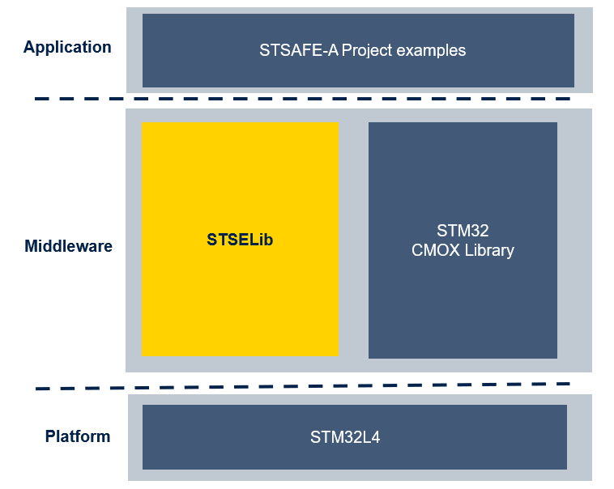

# STSAFE-A120 examples package 

The **STSAFE-A120 example package** offers developers a collection of applicative examples demonstrating the use of the STSAFE-A120 secure element product line from STMicroelectronics. These examples can serve as software reference implementations for integrating STSAFE-A120 devices on host microcontroller platforms. 



Following HW/SW prerequisites are required to work with the package

- Hardware Prerequisites
  - [NUCLEO-L4523](https://www.st.com/en/evaluation-tools/nucleo-l452re.html) STM32 development board
  - [X-NUCLEO-ESE01A1](https://www.st.com/en/evaluation-tools/x-nucleo-ese01a1.html#overview) Nucleo expansion board

- SW prerequisites 
  - One of the following compatible toolchain/IDE 
    - [STM32CubeIDE](https://www.st.com/en/development-tools/stm32cubeide.html)
    - [Keil uVision 5.37](https://www.st.com/en/partner-products-and-services/arm-keil-mdk.html)
    - [IAR ewarm 9.40.1](https://www.st.com/en/partner-products-and-services/iar-embedded-workbench-for-arm.html)
  - [MbedTLS 3.6.2](https://github.com/Mbed-TLS/mbedtls) (included as submodule)
  - [Doxygen v1.14.0](https://github.com/doxygen/doxygen/releases/tag/Release_1_14_0) 

Please refer to package documentation to get information on how to get started with the package.

## Building the Documentation 

HTML documentation can either be downloaded as standalone package from the STSELib github repository [release section]()
or compiled from the library sources by executing following commands from the STSELib root directory:

```bash
    cd documentation/resources
    doxygen STSAFE-A120_Examples.doxyfile
    cd ../../Middleware/STSELib/doc/resources/
    doxygen STSELib.doxyfile
```

> [!NOTE]
>
> Doxygen version 1.14.0 is required to build the documentation  


## Installing the MbedTLS Cryptographic Library

This package uses **MbedTLS v3.6.2** (tag: v3.6.2, commit: 107ea89daa) as the cryptographic library, which is included as a git submodule pinned to this specific version.

To initialize the MbedTLS submodule after cloning the repository:

```bash
git submodule update --init --recursive
```

> **NOTE**: MbedTLS is an open-source cryptographic library licensed under Apache 2.0. The submodule is pinned to tag v3.6.2 to ensure stability and reproducibility. The examples in this package require the MbedTLS submodule to be initialized.


